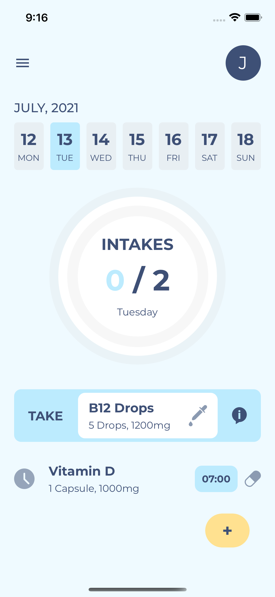

# Medical Reminder App

## 📋 Table of Contents
- [How it works](#how-it-works-)
- [Overview / Screenshots](#overview--screenshots-)
- [What technology is involved?](#what-technology-is-involved-%EF%B8%8F)
- [Challenges I had to take](#challenges-i-had-to-take-)
- [What I learned](#what-i-learned-)

## How it works 🛠️

This React Native Application allows the user to create, update and delete reminders for the intake of his medicines or supplements. 

It also handles signing up, logging in and logging out properly. This allows the user to keep his scheduled intakes more private. When a logged in user closes the App and starts it again he is still logged in. It makes it more comfortable for him because he doesn't have to log in when he starts the App again.

When the reminder is created, an *Expo Push Notification* gets scheduled and when the time and day of the reminder has come a Push Notification gets sent to the user's device reminding him to take his medicine. 

The user can see his progress of taken medicines for that particular day or any other day of the current week. The week gets generated automatically. To visualize his progress there's also a circular progress bar directly on the Home Screen.

It's not important if the App is closed or not. The notification gets sent anyway. 

## Overview / Screenshots 📸

| Login Screen | Sign Up Screen | Home Screen | Pressed Reminder|
|:-------------------------:|:-------------------------:|:-------------------------:|:-------------------------:|
|||||

| Taken Reminder | All Reminders are taken | Add new reminder | Choose a type |
|:-------------------------:|:-------------------------:|:-------------------------:|:-------------------------:|
|||||

| Choose a time | Schedule the day(s) | Edit reminder | Choose updates|
|:-------------------------:|:-------------------------:|:-------------------------:|:-------------------------:|
|||||

| Delete reminder | Push Notification |
|:-------------------------:|:-------------------------:|
|||

## What technology is involved? 🖥️ 

At it's core, this App is built with **React Native** to run on iOS and Android Smartphones with writing the code only once. The App is built with a **managed workflow** from **Expo**. It speeds up the process of setting everything up and to run it on a physical device you just have to scan a QR Code with the **Expo Go** App. 

For sending the push notifications I've chosen **Expo Push Notifications** that send the notifications reliable to Android and iOS devices once the permission is granted and a device token is registered. It also comes in very handy to schedule the notifications for future events.

The **UI Components** are mostly built by my own but the foundation for those comes from the native components of **React Native** itself and from **React Native Elements**. 

To persist the user's reminders and to handle the authentication properly I've integrated the connection to **Firebase** because it comes along with a lot of features, is already hosted in the Cloud and is very smooth to connect with React Native. I also wanted to learn how to build an App with React Native and Firebase. So I picked it up and don't regret it.

Of course State Management is always an important topic, too. So I picked **Redux** because I'm a big fan of it and my experience with it helped me to speed up the development process.

There are other 3rd Party Packages involved that gave me lot of flexibility. Some of them are **react-native-dropdown-picker**, **react-native-keyboard-aware-scroll-view**, **react-native-modal-datetime-picker** and **react-native-side-drawer**.

To boost the user experience I decided to integrate haptic feedback. **Expo** comes along with it's own package called **expo-haptics**. It's pretty straight-forward and runs like a charm on Android and iOS devices.

## Challenges I had to take 💪🏻 

One of the main challenges was to synchronize the App state with Firebase. For example when the user edited his reminder and switched back to the HomeScreen, the App had to fetch the new updated intakes and display the updates. Same goes for creating and deleting an individual intake. But *React* has got `useEffect` and `useState` hooks where a re-rendering of the components comes in very handy once the updated data is fetched successfully.

Another major challenge that took me the longest to figure out was to schedule the *Expo Push Notifications*. That's because it was new to me (it's always hard before it becomes easy) and it's a quite complex topic with a complex documentation. But reading and understanding the documentation, researching for the solutions and trying them out is daily business for me. So I kept pushing through and finally I made it.

## What I learned 💡 

- How to work with Javascripts `Date` Object on a much deeper scale 
- Integrate and use Firebase inside a React Native Application
- Deal with Expo Push Notifications
- Implement a theming and custom fonts with React Native
- Synchronize a Database with the App State 
- How to use haptics properly
- Building solutions for Android only or iOS only problems (and become more aware of them)
- Work with date functions to build out a calendar
- Integrate a ScrollView that works on Android and iOS when the keyboard is open

